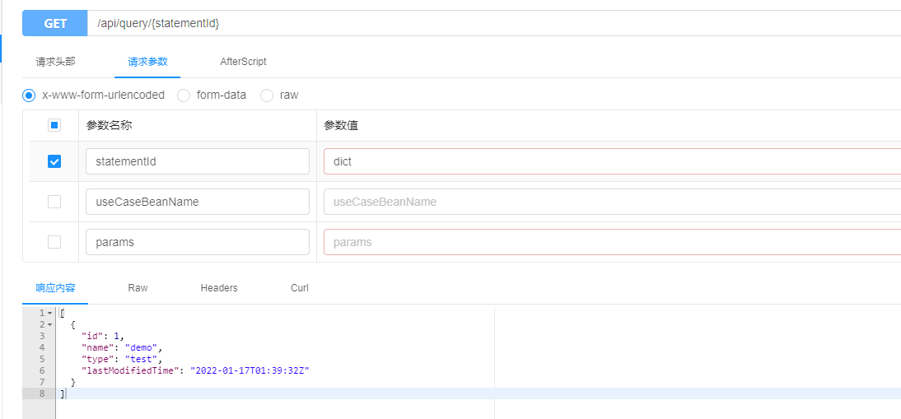
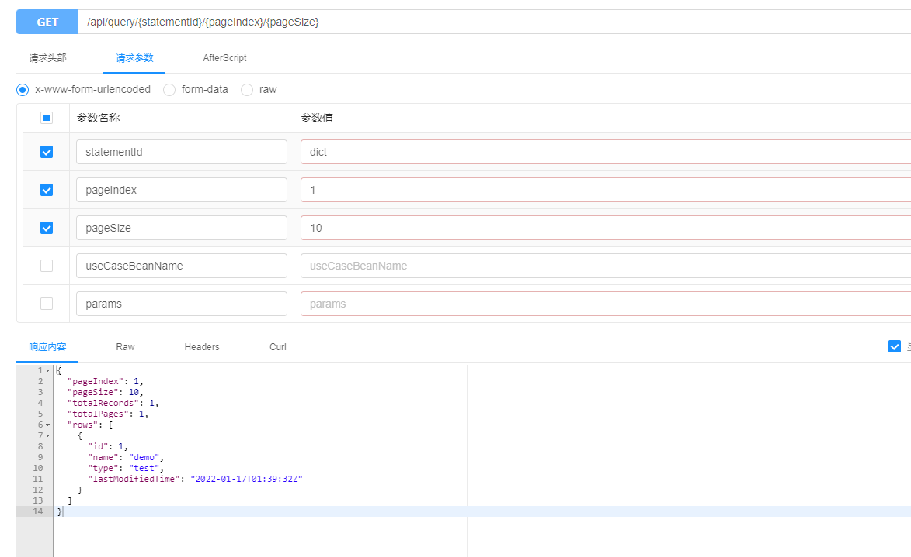

# 查询服务

本着简单高效的原则和灵活高效的原则，框架提供了统一的查询入口，即开发人员只需要编写sql既可以实现查询功能

## 如何使用

1. 添加对应的查询语句
```xml
<?xml version="1.0" encoding="UTF-8" ?>
<!DOCTYPE mapper PUBLIC "-//mybatis.org//DTD Mapper 3.0//EN" "http://mybatis.org/dtd/mybatis-3-mapper.dtd" >
<mapper namespace="com.github.halower">
    <select id="dict_query" resultType="com.github.halower.rest.dto.DictRepresentation">
        SELECT id, name, type, last_modified_time FROM dict
        <where>
            <if test="name!=null">
                and name LIKE "%"#{name}"%"
            </if>
            <if test="type!= null">
                and type = #{type}
            </if>
        </where>
    </select>
</mapper>
```
## 直接进行查询

### 简单查询

### 分页查询


## 如何扩展

> 偶尔需要个别服务可能需要对入参，或者结果进行加工，只需要自定义类继承`AbstractQueryUseCase`即可，然后进行上述查询传入对应的参数`useCaseBeanName`为 `test_query`即可

```java
@CustomQuery("test_query")
public class MyQueryUseCase extends AbstractQueryUseCase {
    public MyQueryUseCase(IQueryUseCase queryApplicationService) {
        super(queryApplicationService);
    }

    @Override
    public void beforeQuery(Map<String, Object> params) {
        System.out.println("beforeQuery");
    }
    @Override
    public List<?> afterQuery(List<?> result) {
        System.out.println("afterQuery");
        return result;
    }
    @Override
    public PageWrapper<?> afterQuery(PageWrapper<?> result) {
        System.out.println("afterQuery");
        return result;
    }
}

```

## 示例说明
- beforeQuery  对入参进行处理
- afterQuery  对查询结果进行处理